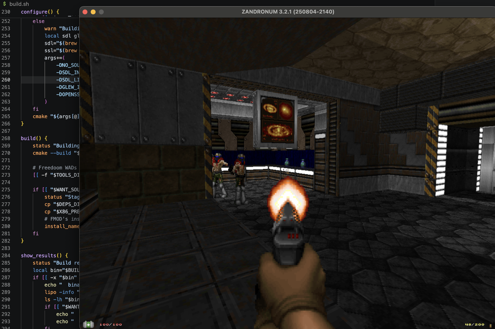

<p align="center">
  
  &nbsp;&nbsp;
  
</p>

# Zandronum EZ macOS Compilation


# Tl;dr
This project gives you a super easy way to develop the [Zandronum source port](https://www.youtube.com/watch?v=cR5GJCW8S9Q) on macOS. You'll need Xcode command line tools (`xcode-select --install`), [Homebrew](https://brew.sh), and Git installed.

## How to Use
1. In Terminal, run:
   ```bash
   git clone https://github.com/rc4l/zandronum-macos-compile.git
   cd zandronum-macos-compile
   ```
2. Then run: `./build.sh` to setup everything. This'll take a while the first time. You should see a runnable `Zandronum.app` in `build/` (just double-click it to play).
3. You can now make code changes in `src/zandronum` (never in `build/`) and rerun `./build.sh` to update your game.

# Technical Details

## When to rerun `./build.sh`
- Do you want to make a new build to test your changes? Don't delete anything and rerun it.
- Do you want to wipe everything clean including code changes? Delete `/deps`, `/build`, and `/src/zandronum` and then rerun it.
- Do you just want to do a clean reinstall but keep your code changes? Delete `/deps` and `/build` and then rerun it.

## Output
- `build/`: This is where your compiled Zandronum appears. The easiest thing to run is **`build/Zandronum.app`** — a normal macOS app you can double-click (or `open build/Zandronum.app`). The loose `zandronum` binary and its data files are still here too if you prefer the command line.
- `deps/`: This folder holds all the stuff the script downloads and builds to make the build work (libraries, FMOD, etc). You almost never need to touch this.
- `src/zandronum`: The Zandronum source code (edit your code here).

## Dependency Table
| Dependency                | Version      | Source/URL                                                                 | Installation Type | What do? (Why is it needed?)                                                                                 | Notes / Portability                |
|---------------------------|-------------|----------------------------------------------------------------------------|-------------------|--------------------------------------------------------------------------------------------------------------|------------------------------------|
| Xcode Command Line Tools  | Any          | `xcode-select --install`                                                   | System            | Compiles (builds) Zandronum with clang.                                                                       | User must install                  |
| Homebrew                  | Any          | https://brew.sh                                                            | System            | Installs the build tools and libraries below.                                                                 | User must install                  |
| Git                       | Any          | https://git-scm.com/                                                       | System            | Downloads this repository.                                                                                     | User must install                  |
| CMake                     | Any          | Homebrew (`brew install cmake`)                                            | Homebrew          | Tells your computer how to build Zandronum from the source code.                                              | Installed by build.sh              |
| Mercurial                 | Any          | Homebrew (`brew install mercurial`)                                        | Homebrew          | Downloads the Zandronum source code from the official repository.                                             | Installed by build.sh              |
| pkg-config                | Any          | Homebrew (`brew install pkg-config`)                                       | Homebrew          | Helps CMake find the libraries.                                                                               | Installed by build.sh              |
| SDL2 + sdl12-compat       | 2.30.10 / 1.2.68 | Homebrew (native) or source (Intel build)                              | Homebrew/Portable | Window, input, video and OpenGL context.                                                                      | Native from Homebrew; Intel built from source to deps/ |
| GLEW                      | 2.2.0        | Homebrew (native) or source (Intel build)                                  | Homebrew/Portable | OpenGL extension loading for the renderer.                                                                    | Native from Homebrew; Intel built from source to deps/ |
| OpenSSL                   | 3.5.1        | Homebrew (native) or source (Intel build)                                  | Homebrew/Portable | Lets Zandronum connect to servers securely (for multiplayer over the internet).                               | Native from Homebrew; Intel built statically from source |
| Opus                      | 1.5.2        | Homebrew (native) or committed in tools/opus/ (Intel build)                | Homebrew/Portable | Lets Zandronum use voice chat in multiplayer games.                                                           | Committed source archive, built for the Intel build |
| FMOD Ex                   | 4.44.64      | https://zdoom.org/files/fmod/ (downloaded dmg)                             | Portable          | Lets Zandronum play music and sound effects.                                                                  | Intel only; downloaded and staged to deps/ |
| Freedoom WADs             | Latest       | https://freedoom.github.io/ (mirrored in tools/freedoom/)                  | Portable          | Free game data so you can run and test Zandronum even if you don't own Doom.                                  | Bundled into Zandronum.app (and next to the loose binary) |

## Sound and Apple Silicon
`./build.sh` builds with full audio by default. FMOD (the audio library Zandronum uses) was never released for Apple Silicon, so on those Macs the build is compiled for Intel and runs under Rosetta 2, which is installed automatically if it's missing. On an Intel Mac it just builds natively.

If you'd rather have a native Apple Silicon build and don't care about in-game audio, run `SOUND=0 ./build.sh`.

## License
This build system is provided as-is for convenience. Zandronum and all third-party dependencies retain their original licenses. See their respective sites for details.

---

Enjoy portable, hassle-free Zandronum development on macOS!
